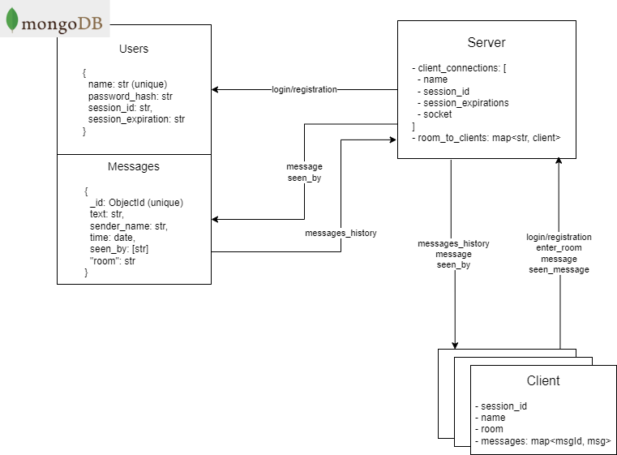

# Granuchat
A chat.

## Running
### Run the server
In server folder, execute `run-docker.sh`

### Run the client
In client folder, execute `run-docker.sh`

# How does it work
Let's consider a typical scenario of two users interacting.
* server starts up, initializing a db connection and empty list of clients
* user A registers: 
  * user is created in db 
  * session_id is generated in backed, stored in the db and sent back to client
  * following requests will require a valid session_id, which will expire at some point in the future
* user A chooses room
  * room name is sent to server. server remembers the room for the client.
  * server sends the client a list of messages history in the room, if there is one
* user A sends a message:
  * server broadcasts the message to all the clients in the room (just the sender for now)
  * sender (user A) receives message and displays it on screen.
  * sender will send a "seen_message" request to server
  * server will broadcast the "seen_by" to everyone else in the room
* user B logs in:
  * user is retrieved from db
  * new session_id is generated and sent to client
  * if the same user is already logged in, the other session is ended because session_id has changed
* user B chooses room
  * server sends user B the list of messages in the room
  * per message, user B will send "seen_message" if he didn't see the message previously (if message.seen_by doesn't include him)
  * server will broadcast the "seen_by" to everyone else in the room

Below is an architecture diagram of the system:

